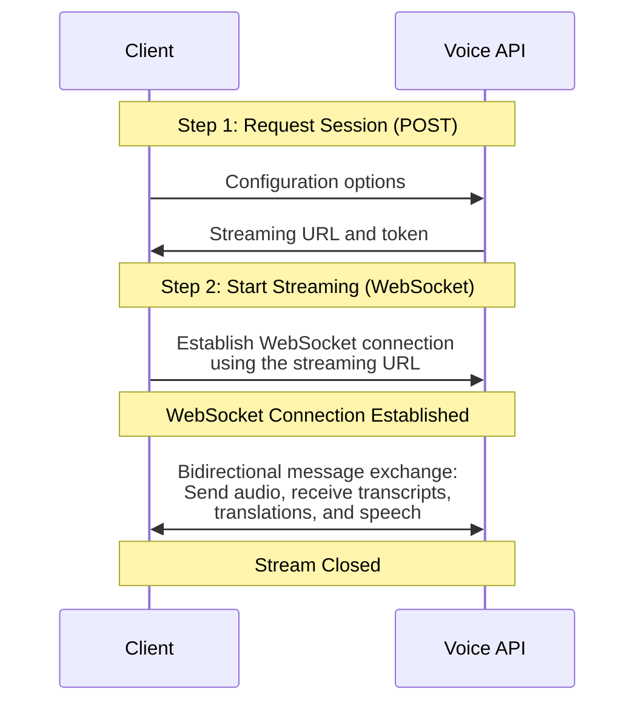
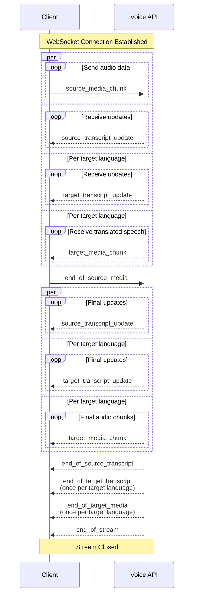

This page explains the lifecycle of a Voice API session: how a connection is established, how tokens keep it secure and resumable, and how audio and results flow over the WebSocket. To run this flow end to end first, see the [Real-Time Voice Quickstart](/docs/voice/real-time-voice-quickstart).

## The two-step connection flow

Every Voice API session starts with two steps:

1. [Request a session](/api-reference/voice/request-session) with a POST request to `/v3/voice/realtime`. This is where authentication happens and where you fix the session's configuration: audio formats, source and target languages, glossaries, spoken terms, and [message encoding](/docs/voice/message-encoding). The response contains an ephemeral streaming URL and a token, both valid for one-time use.
2. [Open a WebSocket connection](/api-reference/voice/websocket-streaming) to the streaming URL, passing the token as a query parameter. All audio and results are exchanged as messages over this connection.

Splitting setup from streaming keeps your API key out of the WebSocket handshake and settles all configuration before any audio flows. The WebSocket itself carries only audio and results.

<Accordion title="Show flow diagram">

</Accordion>

## Tokens and reconnection

Network connections are unreliable, so the Voice API is built around resumable sessions. A session is identified and secured by its token, which rotates over its lifetime: the initial session response and every reconnection response contain a new token, and your client should always keep the most recent one.

If the connection drops, you exchange the latest token for a new streaming URL and token via [GET `/v3/voice/realtime`](/api-reference/voice/reconnect-session), then reconnect and pick up where you left off. Session state, including configuration and translation context, is preserved across reconnections.

Two security properties follow from the token design:

* Each token and streaming URL is valid for one-time use. Using a token more than once to open a WebSocket connection terminates the session immediately.
* Only the latest token can request a reconnection. Presenting an outdated token invalidates the session.

Requesting a reconnection token while a connection is still active disconnects that connection, so only reconnect after the existing connection has closed. Connections also have a maximum duration; when it's reached, reconnect the same way to continue the session. See [session limits](/docs/voice/supported-languages-formats-and-limits#session-limits) for the exact values.

## How audio and results flow

Once connected, you send audio continuously as [source media chunk](/api-reference/voice/websocket-streaming) messages. Smaller chunks mean lower latency, because the API can start processing sooner. When the audio ends, an [end of source media](/api-reference/voice/websocket-streaming) message tells the API to finalize all pending results. Keep audio flowing: a session with no incoming data times out and is terminated.

As audio is processed, transcripts and translations arrive incrementally via [source transcript updates](/api-reference/voice/websocket-streaming) and [target transcript updates](/api-reference/voice/websocket-streaming). Each update distinguishes two kinds of segments:

* **Concluded segments**: finalized text that will not change. These are sent once and remain fixed.
* **Tentative segments**: preliminary text that may be refined as more audio context becomes available.

Applications typically append concluded segments to the running transcript and display tentative segments as provisional text that gets replaced by later updates.

### Translated speech (closed beta)

When a translated speech target is configured, synthesized audio arrives incrementally as [target media chunks](/api-reference/voice/websocket-streaming). To save bandwidth, the stream contains only speech, without silence or padding, so there are gaps with no data whenever the speaker pauses. Each chunk carries text and audio duration information, which you can use to highlight the currently spoken text or to subtitle the audio output.

<Accordion title="Show detailed message flow">

`par` means parallel execution and `loop` means looped execution.
</Accordion>
